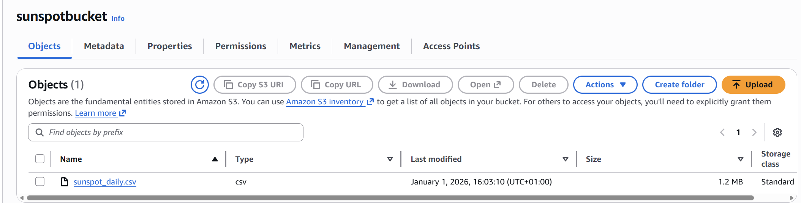
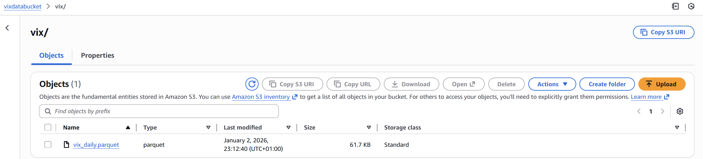
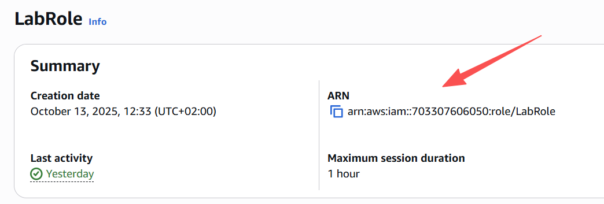
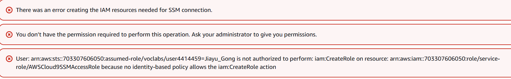
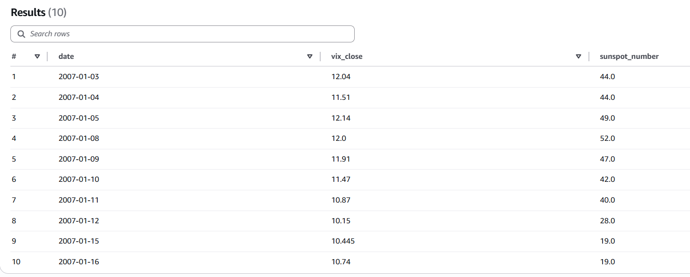
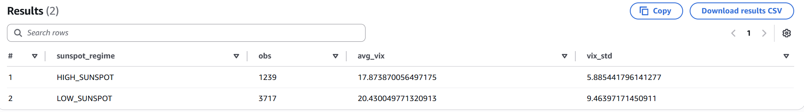
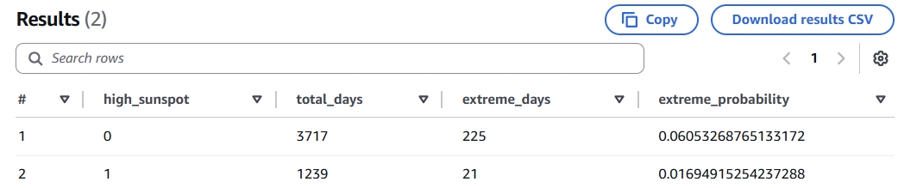
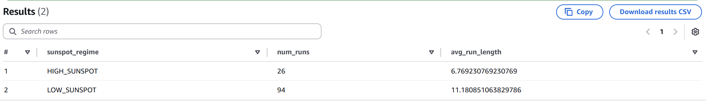
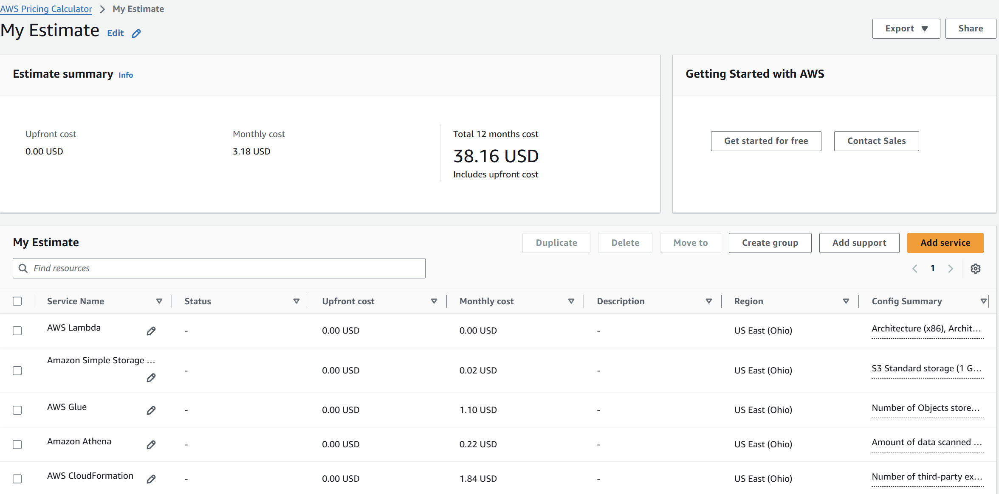

# Final Project of Large-Scale Data Architectures  
## Exploring the Relationship between Sunspot Number and VIX
---


### Target Audience (Stakeholders)

The primary stakeholders of this project are:
- Market analysts and risk analysts dedicated to deciphering the drivers of market volatility
- Quantitative researchers exploring alternative data sources for financial analysiss

Secondary stakeholders include:
- Individual investors seeking supplementary background information on market risk
- Academic researchers studying behavioral finance and market sentiment
---
### Business Value
This project provides value by evaluating whether solar activity, measured by daily sunspot numbers, contains additional information relevant to market volatility, represented by the VIX index.

Key benefits include:
- Enhancing risk awareness by analyzing potential external indicators of market uncertainty
- Providing a structured framework for evaluating the utility of alternative data sources
- Assisting decision-makers in determining whether solar activity data should be incorporated into market volatility.
---
## Pipeline Architecture
### Sunspot Data Preparation

The sunspot data used in this project were obtained from the SILSO (Sunspot Index and Long-term Solar Observations) repository in plain text format (`SN_d_tot_V2.0.txt`).  
Due to the irregular structure of the raw ASCII file, an intermediate data cleaning step was performed using a Jupyter Notebook.

A Python Jupyter Notebook (`sunspotData.ipynb`) was used to:
- Extract only relevant columns (year, month, date, daily sunspot number)
- Convert invalid values (-1) to missing values (`np.nan`)
- Construct standard calendar date fields
- Export the cleaned dataset to Apache Parquet format
The final cleaned dataset was exported as:


#### Output Dataset Description

The `sunspot_daily.parquet` file contains the following fields:

| Column name       | Description |
|-------------------|-------------|
| date              | Calendar date (YYYY-MM-DD) |
| sunspot_number    | Daily total sunspot number; missing values indicate days without reliable observations |

Missing values are intentionally retained as `NULL` to reflect the availability of the original data and ensure compatibility with SQL-based analysis.
#### Upload Dataset to S3

After preprocessing, the cleaned sunspot dataset was uploaded to Amazon S3, which serves as the cloud-based storage layer of the data pipeline.

Amazon S3 was selected for its scalability, durability, and compatibility with analytical services such as Amazon Athena and Amazon Redshift.


### VIX(CBOE Market Volatility Index) Data Preparation

### VIX Data Ingestion (FRED API)

The VIX dataset is collected from Yahoo Finance via the external public API provided by the Federal Reserve Economic Data (FRED).
The initial approach using Yahoo Finance encountered limitations in cloud-based automated requests, triggering HTTP 429 (Too Many Requests) errors.
Kinesis Data Streams was considered but not adopted due to its higher cost and operational overhead, as the project requirements did not demand continuous real-time streaming.

The AWS Lambda function performs the following steps:
1. Calls the API endpoint 
2. Parses the JSON response into a tabular structure
3. Handles missing values using linear interpolation
4. Converts to Apache Parquet
5. Uploads the Parquet output in Amazon S3

Output schema:
- date (TIMESTAMP): trading day
- vix_close (DOUBLE): daily VIX close value

```python
import pandas as pd
import requests
import boto3
import pyarrow as pa
import pyarrow.parquet as pq
from io import BytesIO
import time

def lambda_handler(event, context):

    # Build Yahoo Finance CSV API URL
    period1 = 0  
    period2 = int(time.time())  # current timestamp

    url = (
        "https://query1.finance.yahoo.com/v7/finance/download/%5EVIX"
        f"?period1={period1}&period2={period2}"
        "&interval=1d&events=history&includeAdjustedClose=true"
    )

    response = requests.get(url)
    response.raise_for_status()

    vix = pd.read_csv(BytesIO(response.content))

    vix = vix[["Date", "Close"]]
    vix.columns = ["date", "vix_close"]

    vix["date"] = pd.to_datetime(vix["date"])
    vix = vix.sort_values("date")
    vix["vix_close"] = vix["vix_close"].interpolate(method="linear")
    vix = vix.dropna(subset=["vix_close"])

    table = pa.Table.from_pandas(vix)
    buffer = BytesIO()
    pq.write_table(table, buffer)

    s3 = boto3.client("s3")
    s3.put_object(
        Bucket="vixdatabucket",
        Key="vix_daily.parquet",
        Body=buffer.getvalue()
    )

    return {
        "statusCode": 200,
        "body": {
            "message": "VIX data successfully ingested via Yahoo Finance CSV API",
            "records": len(vix)
        }
    }
```

Missing values in the VIX dataset were handled using linear interpolation.

### Data Schema
#### Run Glue Crawlers
AWS Glue Crawlers were executed to automatically infer table schemas and register metadata in the AWS Glue Data Catalog.


This table contains daily observations of sunspot activity indexed by calendar date.


This table stores daily closing values of the VIX index.


This approach ensures that schema updates are automatically detected if new data files are added in the future.
### Creating a CloudFormation template for an AWS Glue crawler
It would be helpful to reuse crawlers across different environments, especially when new data is added to the datasets. It would also be helpful to use the AWS CLI to run the crawler.
IAM Console → Roles → gluelab → Summary → ARN

arn:aws:iam::703307606050:role/LabRole
Cloud9  → Open IDE → File → New File
make a market_data_crawlers.yml
```yml
AWSTemplateFormatVersion: '2010-09-09'

Parameters:                                                                       # Parameters for crawler and database names

  GlueDatabaseName:
    Type: String
    Default: market_data

  VIXCrawlerName:
    Type: String
    Default: cfn-crawler-vix

  SunspotCrawlerName:
    Type: String
    Default: cfn-crawler-sunspot

  VIXTablePrefix:
    Type: String
    Default: vix_

  SunspotTablePrefix:
    Type: String
    Default: sunspot_

# Resources section defines metadata for the Data Catalog
Resources:

# Create a database to contain tables created by the crawlers
  MarketDataDatabase:
    Type: AWS::Glue::Database
    Properties:
      CatalogId: !Ref AWS::AccountId
      DatabaseInput:
        Name: !Ref GlueDatabaseName
        Description: "AWS Glue catalog for VIX and Sunspot datasets"

# Create a crawler to crawl VIX daily data
  VIXCrawler:
    Type: AWS::Glue::Crawler
    Properties:
      Name: !Ref VIXCrawlerName
      Role: arn:aws:iam::703307606050:role/LabRole
      Description: AWS Glue crawler to crawl daily VIX index data
      DatabaseName: !Ref GlueDatabaseName
      Targets:
        S3Targets:
          - Path: "s3://vixdatabucket/vix"
      TablePrefix: !Ref VIXTablePrefix
      SchemaChangePolicy:
        UpdateBehavior: "UPDATE_IN_DATABASE"
        DeleteBehavior: "LOG"
      Configuration: "{\"Version\":1.0,\"CrawlerOutput\":{\"Tables\":{\"AddOrUpdateBehavior\":\"MergeNewColumns\"}}}"

# Create a crawler to crawl Sunspot daily data
  SunspotCrawler:
    Type: AWS::Glue::Crawler
    Properties:
      Name: !Ref SunspotCrawlerName
      Role: arn:aws:iam::703307606050:role/LabRole
      Description: AWS Glue crawler to crawl daily sunspot activity data
      DatabaseName: !Ref GlueDatabaseName
      Targets:
        S3Targets:
          - Path: "s3://sunspotbucket/"
      TablePrefix: !Ref SunspotTablePrefix
      SchemaChangePolicy:
        UpdateBehavior: "UPDATE_IN_DATABASE"
        DeleteBehavior: "LOG"
      Configuration: "{\"Version\":1.0,\"CrawlerOutput\":{\"Tables\":{\"AddOrUpdateBehavior\":\"MergeNewColumns\"}}}"
```
then try to start these crawlers
```bash
aws glue start-crawler --name cfn-crawler-sunspot
aws glue start-crawler --name cfn-crawler-sunspot
```
To create the CloudFormation stack, run the following command:
```bash
aws cloudformation create-stack \
  --stack-name market-data-crawlers \
  --template-body file://market_data_crawlers.yml \
  --capabilities CAPABILITY_NAMED_IAM
```
To verify that the AWS Glue database was created in the stack, run the following command:
```bash
aws glue get-databases
```
To verify that the crawler was created, run the following command:
```bash
aws glue list-crawlers
```
However, we do not have permision to do these.


---
### KPI Queries in Athena

Two external tables were created in Amazon Athena to query daily VIX index and sunspot data stored in Amazon S3. Both tables utilize the Parquet format for efficient analytical queries. As external tables, Athena manages only the metadata while the underlying data remains in S3.
```sql
CREATE EXTERNAL TABLE market_data.vix_daily (
    date TIMESTAMP,
    vix_close DOUBLE
)
STORED AS PARQUET
LOCATION 's3://vixdatabucket/vix/';

```

```sql
CREATE EXTERNAL TABLE market_data.sunspot_daily (
    date DATE,
    sunspot_number DOUBLE
)
STORED AS PARQUET
LOCATION 's3://sunspotbucket/sunspot/';
```

Try to test
```sql
SELECT
    CAST(v.date AS DATE) AS date,
    v.vix_close,
    s.sunspot_number
FROM market_data.vix_daily v
LEFT JOIN market_data.sunspot_daily s
  ON CAST(v.date AS DATE) = s.date
ORDER BY date
LIMIT 10;
```


It indeed work
#### KPI 1: VIX Level and Volatility(Standard Deviation) on Sunspot Regimes


This KPI provides a descriptive comparison of market risk conditions across Sunspot regimes.  
Observed differences in VIX levels or dispersion, measured by the **standard deviation** may indicate that Sunspot activity coincides with distinct market environments.

The analysis is intended to highlight **regime-based distributional differences**, rather than to establish causal relationships.

**HIGH_SUNSPOT**: Sunspot number at or above the 75th percentile
**LOW_SUNSPOT**: Sunspot number below the 75th percentile  

Then we label each day \(t\) into one of two regimes:

\[
R_t =
\begin{cases}
\text{HIGH\_SUNSPOT}, & \text{if } SN_t \ge q_{0.75}^{SN},\\
\text{LOW\_SUNSPOT}, & \text{if } SN_t < q_{0.75}^{SN}.
\end{cases}
\]

##### Observation Count
\[
n_r = \sum_{t=1}^{T} \mathbf{1}(R_t=r).
\]

##### Average VIX Level (Mean)
\[
\bar{VIX}_r = \frac{1}{n_r}\sum_{t\in\mathcal{T}_r} VIX_t.
\]

This measures the typical level of implied volatility under regime \(r\).

##### Dispersion of VIX Levels (Standard Deviation)

\[
s_r = \sqrt{\frac{1}{n_r-1}\sum_{t\in\mathcal{T}_r}\left(VIX_t-\bar{VIX}_r\right)^2}.
\]

- larger \(s_r\) implies VIX levels are more spread out (higher variability) within regime \(r\),
- smaller \(s_r\) implies VIX levels are more concentrated (more stable) within regime \(r\).
```sql
CREATE OR REPLACE VIEW market_data.vix_sunspot_regime_stats AS
WITH base AS (
    SELECT
        CAST(v.date AS DATE) AS date,
        v.vix_close,
        s.sunspot_number
    FROM market_data.vix_daily v
    JOIN market_data.sunspot_daily s
        ON CAST(v.date AS DATE) = s.date
),
thresholds AS (
    SELECT
        approx_percentile(sunspot_number, 0.75) AS sunspot_p75
    FROM base
),
labeled AS (
    SELECT
        b.date,
        b.vix_close,
        CASE
            WHEN b.sunspot_number >= t.sunspot_p75 THEN 'HIGH_SUNSPOT'
            ELSE 'LOW_SUNSPOT'
        END AS sunspot_regime
    FROM base b
    CROSS JOIN thresholds t
)
SELECT
    sunspot_regime,
    COUNT(*) AS obs,
    AVG(vix_close) AS avg_vix,
    STDDEV(vix_close) AS vix_std
FROM labeled
GROUP BY sunspot_regime
ORDER BY sunspot_regime;
```



Importantly, these findings indicate that higher sunspot activity is not associated with higher unconditional market volatility. Rather, periods of lower sunspot activity appear to coincide with higher and more dispersed levels of the VIX.

#### KPI 2: Extreme Market Fear Probability under High Sunspot Activity

Definition
This KPI measures whether extreme market panic (days ranking in the top 5% of the VIX index) is more likely to occur during periods of high sunspot activity.

Extreme market fear is defined as days where
VIX ≥ 95th percentile of historical VIX levels.

High sunspot activity is defined as days where
sunspot number ≥ 75th percentile of historical sunspot observations.

This KPI compares the probability of extreme VIX events occurring during periods of high sunspot activity versus periods of low sunspot activity.

##### Methodology

Daily VIX data is joined with daily sunspot data on calendar date.

The **95th percentile of VIX** is computed to capture periods of extreme market stress.
The **75th percentile of sunspot activity** is computed to classify high sunspot regimes.


\[
\text{extreme\_vix}_t =
\begin{cases}
1, & \text{if } VIX_t \ge VIX_{95} \\
0, & \text{otherwise}
\end{cases}
\]

\[
\text{high\_sunspot}_t =
\begin{cases}
1, & \text{if } Sunspot_t \ge Sunspot_{75} \\
0, & \text{otherwise}
\end{cases}
\]

The conditional probability of experiencing extreme market fear is calculated as:

\[
P(\text{Extreme } VIX_t = 1 \mid \text{Sunspot Regime}_t)
\]


```sql
CREATE OR REPLACE VIEW extrememarket  AS
WITH joined AS (
    SELECT
        CAST(v.date AS DATE) AS date,
        v.vix_close,
        s.sunspot_number
    FROM market_data.vix_daily v
    LEFT JOIN market_data.sunspot_daily s
        ON CAST(v.date AS DATE) = s.date  #since the v.date is timestamp
    WHERE s.sunspot_number IS NOT NULL
), #join two table and only contains the not null
thresholds AS (
    SELECT
        approx_percentile(vix_close, 0.95) AS vix_p95,
        approx_percentile(sunspot_number, 0.75) AS sunspot_p75
    FROM joined
),#get the percentails
labeled AS (
    SELECT
        j.*,
        CASE
            WHEN j.vix_close >= t.vix_p95 THEN 1 ELSE 0
        END AS extreme_vix,
        CASE
            WHEN j.sunspot_number >= t.sunspot_p75 THEN 1 ELSE 0
        END AS high_sunspot
    FROM joined j
    CROSS JOIN thresholds t
)#define is the day is high/low sunspot, extreme market or not
SELECT
    high_sunspot,
    COUNT(*) AS total_days,
    SUM(extreme_vix) AS extreme_days,
    CAST(SUM(extreme_vix) AS DOUBLE) / COUNT(*) AS extreme_probability
FROM labeled
GROUP BY high_sunspot
```


This picture shows that 
Extreme market fear is less likely during high sunspot periods, sprcifically, the probability of extreme market panic occurring during periods of low sunspot activity is approximately 3.6 times higher than during periods of high sunspot activity.This implies that extreme market stress is approximately 3.6 times more likely to occur when sunspot activity is relatively low.


#### KPI 3: Volatility Persistence under Sunspot Regimes
The first two KPIs focus on distributional properties of the VIX, while this one captures the temporal clustering of volatility.
Here we examine whether market volatility exhibits different *persistence patterns* under high or low sunspot activity.  


A trading day \( t \) is classified as a high-volatility day if:

\[
VIX_t \ge \text{75th percentile of historical VIX}
\]


- **HIGH\_SUNSPOT**: Sunspot number ≥ 75th percentile  
- **LOW\_SUNSPOT**: Sunspot number < 75th percentile

Each day is labeled as a *high-VIX day* or *low-VIX day* based on the VIX threshold.

For each sunspot regime, the following statistics are computed:
- Number of high-volatility runs
- Average length (in days) of high-volatility runs


Let \( r \in \{\text{HIGH\_SUNSPOT}, \text{LOW\_SUNSPOT}\} \) 

- Number of volatility runs

\[
N_r = \sum_{k} \mathbf{1}(\text{run}_k \in r)
\]

- Average run length

\[
\overline{L}_r = \frac{1}{N_r} \sum_{k \in r} L_k
\]


 A **larger average run length** indicates stronger volatility persistence, meaning that market stress tends to last longer once it emerges.
A **smaller average run length** suggests that volatility spikes are more short-lived and dissipate more quickly.

```sql
CREATE OR REPLACE VIEW market_data.vix_volatility_persistence_sunspot AS
WITH base AS (
    SELECT
        CAST(v.date AS DATE) AS date,
        v.vix_close,
        s.sunspot_number
    FROM market_data.vix_daily v
    JOIN market_data.sunspot_daily s
        ON CAST(v.date AS DATE) = s.date
),

thresholds AS (
    SELECT
        approx_percentile(vix_close, 0.75) AS vix_p75,
        approx_percentile(sunspot_number, 0.75) AS sunspot_p75
    FROM base
),

labeled AS (
    SELECT
        b.date,
        b.vix_close,
        CASE
            WHEN b.vix_close >= t.vix_p75 THEN 1 ELSE 0
        END AS high_vix,
        CASE
            WHEN b.sunspot_number >= t.sunspot_p75 THEN 'HIGH_SUNSPOT'
            ELSE 'LOW_SUNSPOT'
        END AS sunspot_regime
    FROM base b
    CROSS JOIN thresholds t
),

lagged AS (
    SELECT
        *,
        LAG(high_vix) OVER (ORDER BY date) AS prev_high_vix
    FROM labeled
),

runs AS (
    SELECT
        *,
        CASE
            WHEN high_vix = 1
             AND (prev_high_vix = 0 OR prev_high_vix IS NULL)
            THEN 1 ELSE 0
        END AS new_run
    FROM lagged
),

run_ids AS (
    SELECT
        *,
        SUM(new_run) OVER (ORDER BY date) AS run_id
    FROM runs
),

run_lengths AS (
    SELECT
        sunspot_regime,
        run_id,
        COUNT(*) AS run_length
    FROM run_ids
    WHERE high_vix = 1
    GROUP BY sunspot_regime, run_id
)

SELECT
    sunspot_regime,
    COUNT(*) AS num_runs,
    AVG(run_length) AS avg_run_length
FROM run_lengths
GROUP BY sunspot_regime;
```



This pitcure indicates significant differences in the persistence of volatility across distinct solar cycle phases. During solar cycle troughs, high-volatility events not only occur more frequently but also exhibit markedly extended durations, averaging over 11 days. Conversely, high-volatility events during solar cycle peaks tend to be shorter-lived, with average durations falling below 7 days

This suggests that market stress is more persistent and slower to dissipate when sunspot activity is low.


---
## Cost


This project uses a lightweight, serverless AWS architecture.  
All cost estimates are obtained from the **AWS Pricing Calculator** .
- **Upfront cost:** USD 0.00  
- **Estimated monthly cost:** USD 3.18  
- **Estimated annual cost (12 months):** USD 38.16 

Most services incur **near-zero or minimal costs**, with expenses mainly driven by:
  - Data preprocessing (AWS Glue)
  - Infrastructure orchestration (AWS CloudFormation)

Overall, the proposed architecture achieves the research objectives with **high cost efficiency**,  
requiring less than **USD 40 per year**, which demonstrates the practicality and scalability of the solution for small-scale data analysis projects.
### Limitations and Future Improvements

This study focuses on descriptive and exploratory analysis and does not claim causal relationships between solar activity and market volatility. While the data are time-indexed, the analysis does not explore any time series models.
Future research could adopt formal time-series econometric frameworks, such as Cointgration model or Granger causality tests or VAR models , to further investigate predictive relationships and dynamic interactions.